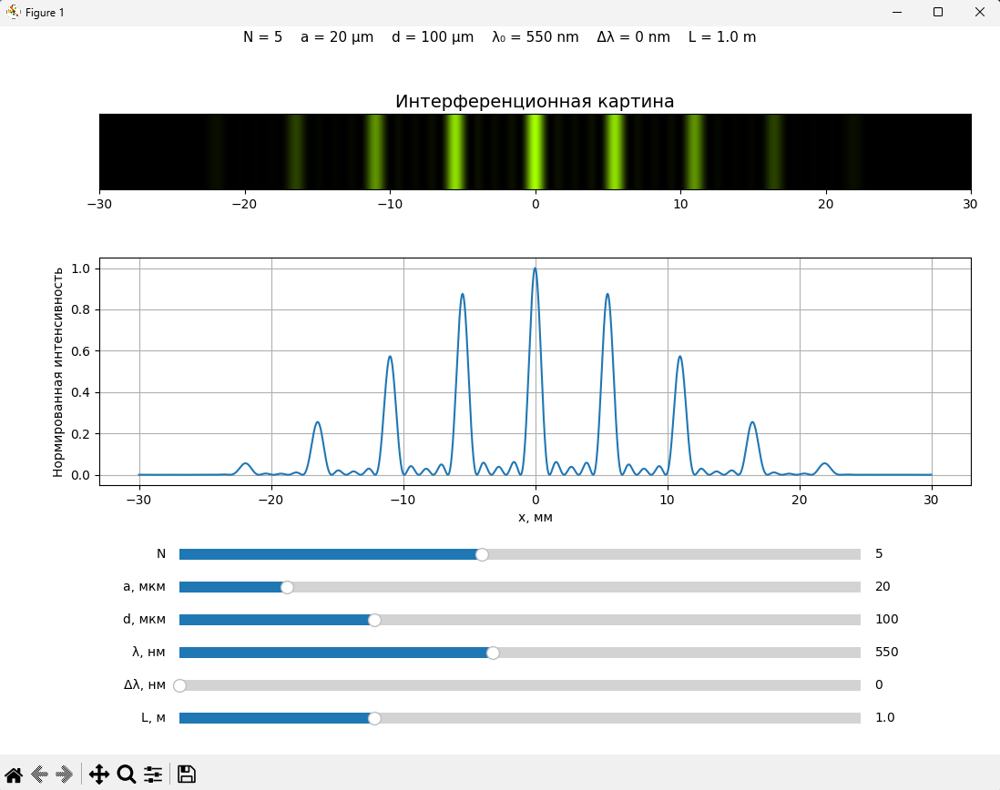
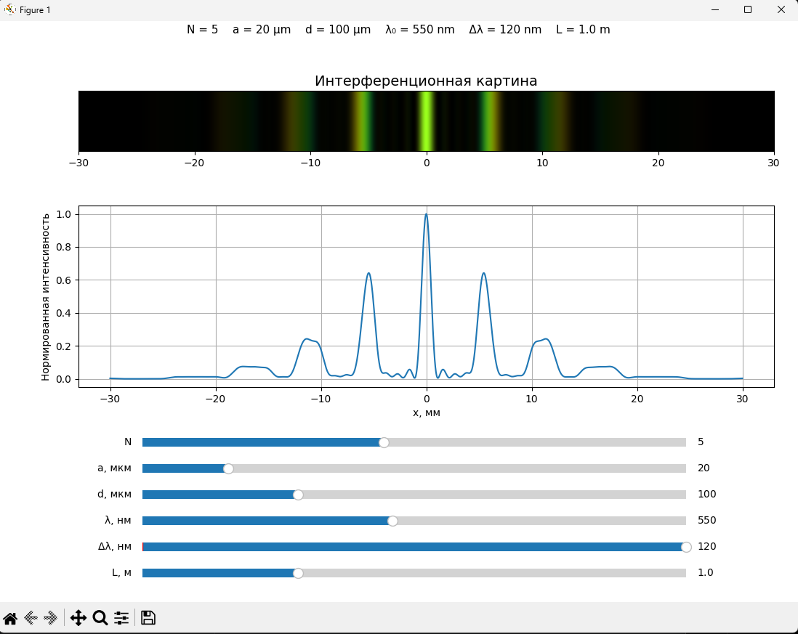

# Моделирование интерференции от N щелей

Интерактивное приложение для моделирования интерференции света от системы из нескольких узких щелей.

Проект позволяет исследовать:

- влияние числа щелей;
- влияние ширины щели;
- влияние периода решётки;
- влияние длины волны;
- влияние ширины спектра;
- изменение интерференционной картины.

Приложение реализовано на Python с использованием численного расчёта распределения интенсивности и визуализации результатов.

---

# Демонстрация

Ниже приведены примеры работы модели.

### Монохроматический свет

<p align="center">
  
</p>

Показана интерференционная картина для одной длины волны.

---

### Квазимонохроматический свет

<p align="center">
  
</p>

При увеличении ширины спектра наблюдается уменьшение контраста и появление цветового разделения.

---

### Анимация изменения ширины спектра

<p align="center">
  
</p>

При увеличении ширины спектра наблюдается постепенное уменьшение контраста интерференционной картины, а также появление цветового разделения и размытия максимумов.

---

# Физическая модель

Рассматривается система из N одинаковых узких щелей.

Используются параметры:

- число щелей — `N`
- ширина щели — `a`
- период между щелями — `d`
- длина волны — `λ`
- расстояние до экрана — `L`

Используется приближение Фраунгофера.

Полная интенсивность вычисляется как произведение:

```text
Интенсивность =
Дифракция одной щели
×
Интерференция N щелей
```

Используемая формула:

```text
I(θ)=I₀·(sin(β)/β)²·(sin(Nα)/sin(α))²
```

где:

```text
β = πa·sin(θ)/λ
```

```text
α = πd·sin(θ)/λ
```

Координата на экране вычисляется как:

```text
θ = arctan(x/L)
```

Дополнительно используется ограничение:

```text
d ≥ a
```

для исключения пересечения щелей.

---

# Монохроматический режим

При:

```text
Δλ = 0
```

используется одна длина волны.

Позволяет исследовать:

- изменение расстояния между максимумами;
- влияние числа щелей;
- изменение дифракционной оболочки.

---

# Квазимонохроматический режим

При:

```text
Δλ > 0
```

модель рассчитывает несколько длин волн:

```text
[λ₀−Δλ/2 ; λ₀+Δλ/2]
```

Итоговая интенсивность определяется усреднением.

Эффекты:

- снижение контраста;
- размытие дальних максимумов;
- появление цветового разделения.

---

# Возможности приложения

## Интерактивное моделирование

Доступно изменение параметров в реальном времени.

Пользователь может изменять:

- N;
- a;
- d;
- λ;
- Δλ;
- L.

---

## Графики

В приложении автоматически строятся:

### 1. Интерференционная картина

Показывает распределение интенсивности на экране.

---

### 2. График интенсивности

Показывает зависимость:

```text
I(x)
```

Позволяет анализировать положение максимумов и минимумов.

---

## Экспорт анимации

Поддерживается экспорт GIF.

Примеры:

```bash
python app.py gif \
--parameter slit_count \
--start 1 \
--end 10
```

```bash
python app.py gif \
--parameter spectrum_width_nm \
--start 0 \
--end 120
```

```bash
python app.py gif \
--parameter central_wavelength_nm \
--start 380 \
--end 750
```

---

# Структура проекта

```text
interference-n-slits
│
├── app.py
├── README.md
├── requirements.txt
│
├── src
│   ├── physics.py
│   ├── color.py
│   ├── spectrum.py
│   ├── interactive.py
│   └── animation.py
│
└── assets
    ├── screenshots
    └── gifs
```

---

# Требования

- Python 3.12+
- Windows 10/11

---

# Установка

```bash
pip install -r requirements.txt
```

---

# Запуск

Интерактивный режим:

```bash
python app.py
```

Экспорт GIF:

```bash
python app.py gif ...
```

---

# Используемые технологии

- Python
- NumPy
- Matplotlib
- ImageIO

---

# Автор

Загородников Евгений Геннадьевич
